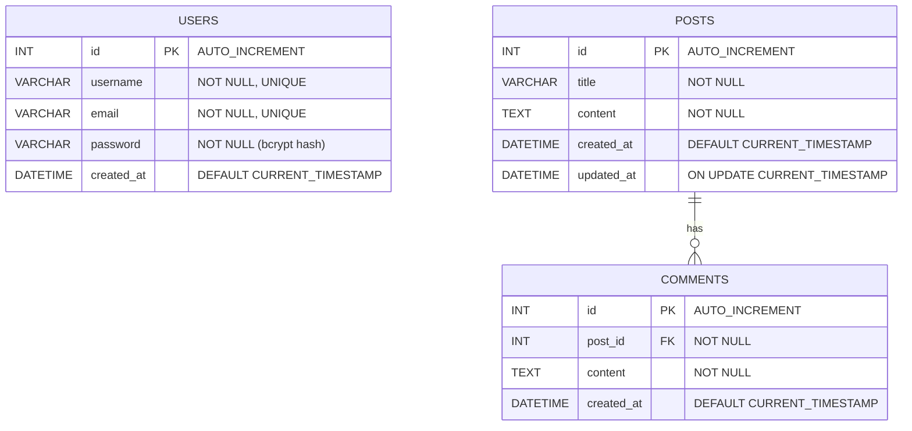

# Orbit - Threaded Discussion Board 🚀

> React + Express + MySQL 기반의 커뮤니티형 스레드 게시판 웹 애플리케이션 — 게시글, 댓글, 회원 기능을 제공하는 풀스택 프로젝트

<br/>

## 📌 목차

1. [프로젝트 소개](#-프로젝트-소개)
2. [기술 스택](#-기술-스택)
3. [주요 기능](#-주요-기능)
4. [ERD](#-erd)
5. [API 명세서](#-api-명세서)
6. [디렉토리 구조](#-디렉토리-구조-directory-structure)
7. [시작 가이드](#-시작-가이드-getting-started)
8. [TODO](#-todo)

<br/>

## 📖 프로젝트 소개

**Bit-Universe**는 사용자가 게시글을 작성하고 댓글로 소통할 수 있는 커뮤니티 웹 서비스입니다.
프론트엔드는 **React(CRA)** 로 SPA를 구성하고, 백엔드는 **Express** 서버가 REST API 제공과 React 빌드 결과물 서빙을 함께 담당합니다.

- 헤더 / 사이드바 / 본문 / 푸터로 구성된 대시보드형 레이아웃
- 게시글 목록 · 작성 · 상세 · 삭제, 게시글별 댓글 작성 · 삭제
- Routes → Controllers → Models 계층으로 분리된 Express 백엔드
- 서버 시작 시 MySQL 데이터베이스와 테이블 자동 생성

<br/>

## 🛠기술 스택 (Tech Stack)

## Frontend

| 구분           | 기술                           |
| ------------ | ---------------------------- |
| Framework    | React + TypeScript           |
| Build Tool   | Vite                         |
| Routing      | React Router                 |
| HTTP Client  | Axios                        |
| Styling      | CSS                          |
| Icons        | react-icons                  |
| Server State | TanStack Query (React Query) |
| Validation   | Zod                          |

## Backend

| 구분                | 기술                               |
| ----------------- | -------------------------------- |
| Runtime           | Node.js 24 LTS                   |
| Language          | TypeScript                       |
| Framework         | Express 5                        |
| Database          | MySQL 8.x                        |
| DB Driver         | mysql2/promise (Connection Pool) |
| Security          | Helmet, CORS, bcryptjs           |
| Authentication    | JWT                              |
| Validation        | Zod                              |
| Configuration     | dotenv                           |
| API Documentation | Swagger / OpenAPI                |
| Logging           | Pino 또는 Winston                  |

## Testing

| 구분               | 기술                            |
| ---------------- | ----------------------------- |
| Unit Test        | Vitest 또는 Node.js Test Runner |
| API Test         | Supertest                     |
| Integration Test | MySQL 테스트 환경 기반 통합 테스트        |

## Database & Infrastructure

| 구분                 | 기술                      |
| ------------------ | ----------------------- |
| Database Migration | 선택한 MySQL 마이그레이션 도구     |
| Container          | Docker, Docker Compose  |
| CI/CD              | GitHub Actions          |
| Deployment         | AWS EC2                 |
| Database Hosting   | AWS RDS for MySQL       |
| File Storage       | AWS S3 (파일 업로드가 필요한 경우) |
| Version Control    | Git, GitHub             |

## Backend Architecture

* **Layered Architecture:** Routes → Controllers → Services → Repositories
* **Validation:** 요청 데이터 검증 및 공통 검증 오류 처리
* **Error Handling:** 공통 에러 미들웨어 및 일관된 오류 응답
* **Authentication & Authorization:** JWT 인증 및 사용자별 접근 권한 검증
* **Database:** 커넥션 풀, 파라미터 바인딩, 트랜잭션 및 롤백
* **Testing:** 정상 케이스, 예외 케이스, 권한 검증 및 주요 비즈니스 로직 테스트
* **API Documentation:** Swagger / OpenAPI를 통한 API 명세 관리


<br/>

## ✨ 주요 기능

### 프론트엔드
| 경로 | 화면 | 설명 |
| --- | --- | --- |
| `/` | Home | 소개 및 게시판 바로가기 |
| `/posts` | 게시판 | 게시글 목록 조회, 새 글 작성 |
| `/posts/:postId` | 게시글 상세 | 본문 조회, 게시글 삭제, 댓글 목록·작성·삭제 |
| `/about` | About | 소개 페이지 |
| `/contact` | Contact | 연락처 페이지 |

- **헤더** — 햄버거 버튼으로 사이드바 열기/닫기, 로고 클릭 시 홈으로 이동
- **사이드바** — `NavLink` 기반 메뉴, 현재 페이지 하이라이트

### 백엔드
- **REST API** — 게시글 / 댓글 / 회원 CRUD
- **DB 자동 초기화** — `server/db/schema.sql`을 실행해 DB·테이블이 없으면 생성
- **비밀번호 보안** — bcrypt 해싱 저장, 모든 응답에서 `password` 필드 제외
- **에러 처리** — 입력 검증(400), 리소스 없음(404), 중복 데이터(409), 서버 오류(500)를 공통 핸들러로 처리
- **SPA 서빙** — `client/build`가 있으면 정적 파일을 제공하고, API 외 모든 경로는 `index.html`로 응답

<br/>

## 🗂 ERD



- 게시글이 삭제되면 해당 게시글의 댓글도 함께 삭제됩니다 (`ON DELETE CASCADE`).
- 테이블 정의 원본: [`server/db/schema.sql`](server/db/schema.sql)

<br/>

## 📡 API 명세서

- **Base URL**: `http://localhost:5000/api`
- **Content-Type**: `application/json`
- 응답 필드는 camelCase (`createdAt`, `postId` 등)

#### 공통 에러 응답

| 상태 코드 | 상황 | 예시 |
| --- | --- | --- |
| `400` | 필수 값 누락 / 잘못된 JSON | `{ "error": "title and content are required" }` |
| `404` | 리소스 없음 / 없는 API 경로 | `{ "error": "Post not found" }` |
| `409` | username·email 중복 | `{ "error": "Duplicate entry" }` |
| `500` | 서버 내부 오류 | `{ "error": "Internal Server Error" }` |

### 게시글 (Posts)

| Method | Endpoint | 설명 | Request Body | 성공 응답 |
| --- | --- | --- | --- | --- |
| `POST` | `/posts` | 게시글 작성 | `{ title, content }` | `201` Post |
| `GET` | `/posts` | 게시글 전체 조회 (최신순) | - | `200` Post[] |
| `GET` | `/posts/:postId` | 게시글 단건 조회 | - | `200` Post |
| `PUT` | `/posts/:postId` | 게시글 수정 (보낸 필드만 변경) | `{ title?, content? }` | `200` Post |
| `DELETE` | `/posts/:postId` | 게시글 삭제 (댓글 포함) | - | `200 { message }` |

### 댓글 (Comments)

| Method | Endpoint | 설명 | Request Body | 성공 응답 |
| --- | --- | --- | --- | --- |
| `POST` | `/comments` | 댓글 작성 | `{ postId, content }` | `201` Comment |
| `GET` | `/comments` | 댓글 전체 조회 | - | `200` Comment[] |
| `GET` | `/comments?postId=1` | 특정 게시글의 댓글 조회 | - | `200` Comment[] |
| `GET` | `/comments/:commentId` | 댓글 단건 조회 | - | `200` Comment |
| `PUT` | `/comments/:commentId` | 댓글 수정 | `{ content }` | `200` Comment |
| `DELETE` | `/comments/:commentId` | 댓글 삭제 | - | `200 { message }` |

### 회원 (Users)

| Method | Endpoint | 설명 | Request Body | 성공 응답 |
| --- | --- | --- | --- | --- |
| `POST` | `/users` | 회원 가입 | `{ username, email, password }` | `201` User |
| `GET` | `/users` | 회원 전체 조회 | - | `200` User[] |
| `GET` | `/users/:userId` | 회원 단건 조회 | - | `200` User |
| `PUT` | `/users/:userId` | 회원 정보 수정 (보낸 필드만 변경) | `{ username?, email?, password? }` | `200` User |
| `DELETE` | `/users/:userId` | 회원 탈퇴 | - | `200 { message }` |

### 기타

| Method | Endpoint | 설명 | 응답 |
| --- | --- | --- | --- |
| `GET` | `/data` | 서버 연결 테스트 | `{ "message": "Hello, world!" }` |

<details>
<summary><b>요청/응답 예시</b></summary>

**게시글 작성** — `POST /api/posts`
```json
// Request
{ "title": "첫 번째 글", "content": "안녕하세요, Bit-Universe!" }

// Response 201
{
  "id": 1,
  "title": "첫 번째 글",
  "content": "안녕하세요, Bit-Universe!",
  "createdAt": "2026-10-09 14:00:00",
  "updatedAt": "2026-10-09 14:00:00"
}
```

**댓글 작성** — `POST /api/comments`
```json
// Request
{ "postId": 1, "content": "환영합니다!" }

// Response 201
{ "id": 1, "postId": 1, "content": "환영합니다!", "createdAt": "2026-10-09 14:01:00" }
```

**회원 가입** — `POST /api/users`
```json
// Request
{ "username": "gaji", "email": "gaji@example.com", "password": "1234" }

// Response 201 (password는 응답에 포함되지 않음)
{ "id": 1, "username": "gaji", "email": "gaji@example.com", "createdAt": "2026-10-09 14:02:00" }
```
</details>

<br/>

## 📁 디렉토리 구조 (Directory Structure)

```
Bit-Universe
├── client/                       # 프론트엔드 (React, CRA)
│   ├── public/                   # index.html, favicon 등 정적 리소스
│   ├── src/
│   │   ├── components/           # 공통 레이아웃 컴포넌트
│   │   │   ├── Header.jsx        # 상단 헤더 (로고, 사이드바 토글)
│   │   │   ├── Sidebar.jsx       # 좌측 메뉴 (NavLink)
│   │   │   └── Footer.jsx        # 하단 푸터
│   │   ├── pages/                # 라우트 단위 페이지
│   │   │   ├── Home.js
│   │   │   ├── Posts.js          # 게시글 목록 + 작성
│   │   │   ├── PostDetail.js     # 게시글 상세 + 댓글
│   │   │   ├── About.js
│   │   │   └── Contact.js
│   │   ├── styles/               # 컴포넌트별 CSS
│   │   ├── api.js                # axios 인스턴스 및 API 호출 함수
│   │   ├── App.js                # 레이아웃 + 라우터 설정
│   │   └── index.js              # React 진입점
│   ├── .env.production           # 빌드 설정 (INLINE_RUNTIME_CHUNK=false)
│   └── package.json
│
├── server/                       # 백엔드 (Express)
│   ├── config/
│   │   └── db.js                 # MySQL 커넥션 풀 + DB 자동 초기화
│   ├── db/
│   │   └── schema.sql            # 테이블 정의
│   ├── models/                   # SQL 쿼리 (데이터 접근 계층)
│   │   ├── Comment.js
│   │   ├── Post.js
│   │   └── User.js
│   ├── controllers/              # 요청 검증 및 응답 처리
│   │   ├── commentController.js
│   │   ├── postController.js
│   │   └── userController.js
│   ├── routes/                   # URL ↔ 컨트롤러 매핑
│   │   ├── commentRoutes.js
│   │   ├── postRoutes.js
│   │   └── userRoutes.js
│   ├── utils/
│   │   └── asyncHandler.js       # async 에러를 Express 에러 핸들러로 전달
│   └── server.js                 # 서버 진입점
│
├── .env.example                  # 환경 변수 템플릿
├── package.json                  # 서버 의존성 및 실행 스크립트
└── README.md
```

**요청 흐름**: `routes` → `controllers` (입력 검증) → `models` (SQL 실행) → MySQL

<br/>

## 🚀 시작 가이드 (Getting Started)

### 요구 사항
- **Node.js** 18 이상
- **MySQL** 8.x 실행 중

### 1. 저장소 클론

```bash
git clone https://github.com/gajigaji04/Bit-Universe.git
cd Bit-Universe
```

### 2. 환경 변수 설정 (`.env`)

`.env.example`을 복사해 프로젝트 **루트**에 `.env`를 만들고 MySQL 접속 정보를 입력합니다.

```bash
cp .env.example .env
```

```env
# Server
PORT=5000

# MySQL
DB_HOST=localhost
DB_PORT=3306
DB_USER=root
DB_PASSWORD=your_password
DB_NAME=bit_universe
```

| 변수 | 설명 | 기본값 |
| --- | --- | --- |
| `PORT` | Express 서버 포트 | `5000` |
| `DB_HOST` | MySQL 호스트 | `localhost` |
| `DB_PORT` | MySQL 포트 | `3306` |
| `DB_USER` | MySQL 사용자 | `root` |
| `DB_PASSWORD` | MySQL 비밀번호 | (빈 값) |
| `DB_NAME` | 사용할 데이터베이스 이름 (없으면 자동 생성) | `bit_universe` |

> `.env`는 `.gitignore`에 포함되어 있어 커밋되지 않습니다.

### 3. 의존성 설치

```bash
npm run install:all     # 서버 + 클라이언트 한 번에 설치
```

### 4. 실행

**▶ 개발 모드** — 서버와 클라이언트를 각각 실행 (클라이언트는 Hot Reload)

```bash
# 터미널 1 — API 서버 (파일 변경 시 자동 재시작)
npm run dev             # http://localhost:5000

# 터미널 2 — React 개발 서버
npm run client          # http://localhost:3000  (/api 요청은 5000번으로 프록시)
```

**▶ 프로덕션 모드** — React 빌드 후 Express가 함께 서빙

```bash
npm run build           # client/build 생성
npm start               # http://localhost:5000
```

서버가 정상 실행되면 다음 로그가 출력됩니다. DB와 테이블은 이때 자동으로 생성됩니다.

```
✅ MySQL 연결 성공! (database: bit_universe)
🚀 Server is running on http://localhost:5000
```

### npm 스크립트

| 명령어 | 설명 |
| --- | --- |
| `npm start` | API 서버 실행 |
| `npm run dev` | API 서버 실행 (파일 변경 시 자동 재시작) |
| `npm run client` | React 개발 서버 실행 |
| `npm run build` | React 프로덕션 빌드 |
| `npm run install:all` | 서버·클라이언트 의존성 설치 |

<br/>

## 🧭 TODO

- [ ] 로그인 / JWT 인증, 게시글·댓글에 작성자(`user_id`) 연결
- [ ] 게시글 수정 화면
- [ ] 게시글 목록 페이지네이션
- [ ] 서버 API 테스트 코드

<br/>

## 👤 Contributors

| <a href="https://github.com/gajigaji04"></a> |
| :---: |
| [@gajigaji04](https://github.com/gajigaji04) |

<br/>

## 📄 License

This project is licensed under the ISC License.
